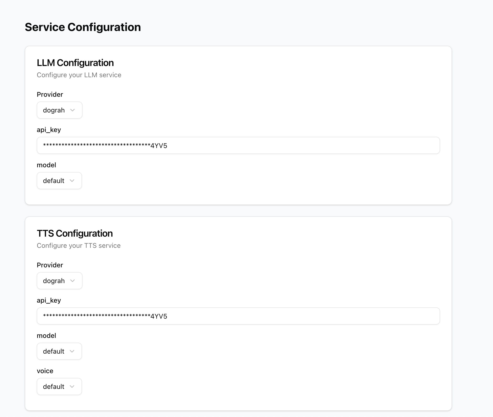

## Configure Inference Provider

You can go to `https://app.dograh.com/service-configurations` if you are on hosted version of Dograh or go to `http://localhost:3010/service-configurations` if you are running Dograh locally.

You can see the configuration for the inference provider in the following screenshot.

You can select the provider from the dropdown and configure the API key, model, etc.

## Next Steps

You can see how to configure the telephony provider in [Telephony Integrations](/telephony/twilio).
